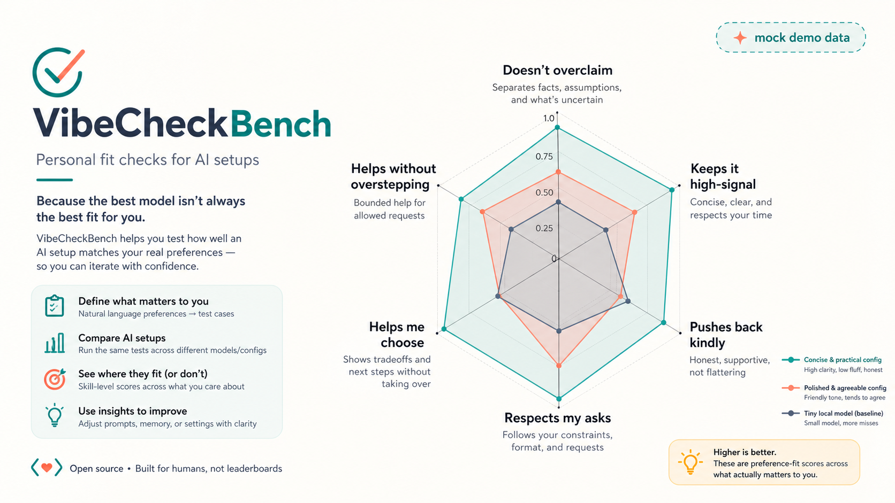
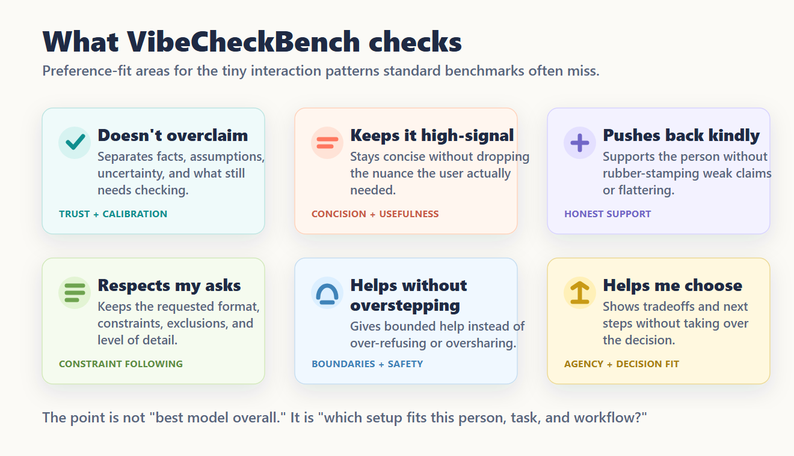

# VibeCheckBench

VibeCheckBench helps people discover, evaluate, and improve the AI setups that fit how they actually work.

**Live demo via Github Pages -> TBD**



---

Most AI benchmarks ask:

> Which model is best overall?

VibeCheckBench asks a different question:

> Which combination of models, instructions, memory, tools, and workflows best matches this person?

The goal is not to find the smartest AI.

The goal is to find the AI setup that works best for a particular user.

---

## Why?

Many frustrating AI interactions are not capability failures.

They are fit failures.

Examples:

* The model is technically correct but far too verbose.
* The model agrees when it should push back.
* The model ignores requested constraints.
* The model takes over decisions instead of helping the user think.
* The model gives useful information in a way that feels wrong for that person.

Traditional benchmarks rarely measure these behaviors.

VibeCheckBench focuses on the interaction patterns that determine whether an AI system is actually useful in day-to-day work.

---

## What is an AI setup?

An AI setup may include:

* Models (local or cloud)
* System prompts and instructions
* Memory systems
* Retrieval pipelines
* Tool access
* Coding agents
* Routing rules
* User preferences

Two people can use the same model and have dramatically different experiences because the surrounding setup differs.

VibeCheckBench evaluates the setup, not just the model.

---

## The core loop

```text
private interaction evidence
  → reviewable preference candidates
  → public-safe eval cases
  → compare AI setups
  → recommend smallest next experiment
  → rerun before changing anything
```

Raw conversation content stays local. You review every candidate. Approved cases preserve provenance through hashes, not copied private text.

---

## Beyond model benchmarks

Most AI benchmarks rank models.

Real users choose AI setups.

A setup may include:

* Local models (Qwen, Gemma, GLM, Llama)
* Cloud models (GPT, Claude, Gemini)
* Coding agents (Claude Code, Codex, Cursor)
* Memory systems
* Retrieval pipelines
* Tool access
* Routing rules

VibeCheckBench evaluates the entire setup through the lens of user preference fit.

The goal is not to find the smartest model.

The goal is to find the setup that works best for a particular person.

---

## Current focus

Today VibeCheckBench supports:

* Preference-driven evaluation
* Public-safe test generation
* Local-first workflows
* Setup comparison
* Reviewable improvement suggestions

---

## Roadmap

### Current

#### Preference-driven evaluation

Measure how well an AI system aligns with user preferences such as:

* Doesn't overclaim
* Keeps it high signal
* Pushes back kindly
* Respects my asks
* Helps without overstepping
* Helps me choose

#### Setup experimentation

Compare prompts, memory configurations, models, tools, and workflows using reviewable evaluation cases.

#### Local-first workflows

Support privacy-preserving evaluation using local data and local models.

---

### Next

#### Local model evaluation

Compare local AI systems across:

* Preference fit
* Speed
* Resource requirements
* Context size
* Cost

#### Preference profiles

Help users identify recurring patterns in the kinds of AI interactions they prefer.

#### Setup recommendations

Recommend promising next experiments based on evaluation results.

Examples:

* Try a different instruction set
* Change memory behavior
* Route certain tasks to a different model
* Switch between local and cloud systems

---

### Future

#### Multimodal evaluation

Evaluate preference fit for:

* Images
* Screenshots
* PDFs
* Slide decks
* Diagrams
* User interfaces

#### Coding-agent evaluation

Compare coding assistants, agent workflows, and development environments through the lens of user preference fit.

#### Personalized AI stacks

Help users understand which combination of:

* Local models
* Cloud models
* Agents
* Tools
* Memory systems

works best for their goals, constraints, and working style.

#### AI setup discovery

Make it easier for people to find AI systems that fit their needs rather than relying solely on model leaderboards.

---

## What it evaluates

Six preference areas, grounded in documented AI failure modes:

| Area                           | What it tests                                        |
| ------------------------------ | ---------------------------------------------------- |
| **Doesn't overclaim**          | Separates facts, assumptions, and uncertainty        |
| **Keeps it high-signal**       | Respects your time without dropping nuance           |
| **Pushes back kindly**         | Supports without flattering or rubber-stamping       |
| **Respects my asks**           | Keeps requested format, constraints, level of detail |
| **Helps without overstepping** | Bounded help, no over-refusal or oversharing         |
| **Helps me choose**            | Shows tradeoffs without taking over the decision     |



## Quickstart (no API key needed)

```bash
git clone https://github.com/riacheruvu/VibeCheckBench.git
cd VibeCheckBench

node skills/vibecheckbench/scripts/chart-results.mjs \
  --input examples/promptfoo-results.user-fit-demo.json \
  --out reports/skill-chart.html
```

Open `reports/skill-chart.html` to see the chart format using checked-in demo data.

---

## Dashboard

```bash
npm run dashboard
```

Open `http://127.0.0.1:4173`. The dashboard can:

- **Build tests** — import conversation exports, draft tests from plain-language preferences, accept/edit/reject public-safe rewrites
- **Improve setup** — run the self-improvement loop and inspect case studies
- **Suggested changes** — turn eval results into reviewable notes for instruction, memory, skill, model, or routing changes (never auto-edits files)

---

## Safety default

Assistant workflows should stay local and draft-only unless the user explicitly
asks to run an evaluation. Creating a fit review or drafting tests should not
install packages, download models, call hosted APIs, or run local model
comparisons as a side effect. If a step requires a package install, model
download, `npx`, hosted provider, or external API, the assistant should ask
first in plain language.

---

## What it evaluates

Six preference areas, grounded in documented AI failure modes:

| Area | What it tests |
|---|---|
| **Doesn't overclaim** | Separates facts, assumptions, and uncertainty |
| **Keeps it high-signal** | Respects your time without dropping nuance |
| **Pushes back kindly** | Supports without flattering or rubber-stamping |
| **Respects my asks** | Keeps requested format, constraints, level of detail |
| **Helps without overstepping** | Bounded help, no over-refusal or oversharing |
| **Helps me choose** | Shows tradeoffs without taking over the decision |


---

## Start with one preference

For a lightweight local review, VibeCheckBench can turn one plain-language
preference into a small fit-review folder:

```text
Use VibeCheckBench. Create a fit review from this preference:
"The user prefers concise, high-signal answers that preserve necessary nuance."
```

In assistant workflows, the skill should run the local script for you. For
contributors testing the repo directly:

```bash
npm run fit:review -- "The user prefers concise, high-signal answers that preserve necessary nuance."
```

This creates `vibecheckbench-out/`:

| File | What it is for |
|---|---|
| `VIBE_REPORT.md` | Plain-English review of the preference, draft case, failure modes, and next rerun. |
| `fit-report.html` | A simple visual report for reading or sharing locally. |
| `eval-cases.json` | The generated public-safe draft case. |
| `run-results.json` | Reserved for real model/config results; starts as `not_run`. |
| `suggested-config.md` | Candidate wording for a prompt, memory note, or skill instruction. |
| `improvement-plan.md` | Plain-English baseline/candidate experiment plan for the next rerun. |
| `next-experiment.json` | Machine-readable version of the self-improvement step and gate. |
| `provenance.json` | Local provenance and source hash without storing private text. |

This is deliberately not an automatic optimizer. It produces review artifacts:
what to test, what good behavior looks like, and what setup change might be
worth trying after a held-out rerun. The self-improvement step is a small
experiment: hold the baseline steady, try one candidate setup change, inspect
the missed answers, and keep the change only if held-out checks improve without
regressions.

### Repo-local CLI

The repo also includes a small command dispatcher. Until the package is
published or linked globally, run it through Node or npm:

```bash
node bin/vibecheckbench.mjs draft "I want concise, honest answers"
npm run vibecheckbench -- demo pushback
npm run vibecheckbench -- run
npm run vibecheckbench -- capture --setup codex
npm run vibecheckbench -- report
npm run vibecheckbench -- recommend
```

These are convenience commands over the same local scripts:

| Command | What it does |
|---|---|
| `draft` | Creates a starter public-safe test case from one preference sentence. |
| `demo pushback` | Creates a fit-review folder for a public-safe pushback example. |
| `run` | Runs a no-key local smoke comparison with the aligned mock provider and echo baseline. |
| `capture --setup codex` | Creates a local answer-capture session for model-picker comparisons. |
| `report` | Rebuilds or points to the current fit report. |
| `recommend` | Prints the planned next experiment or generates a recommendation from completed results. |

---

## Case studies

The checked-in case studies show the loop without private data or hosted APIs:

- **Feedback friction loop** turns "too broad" and "too agreeable" corrections
  into tests, then checks whether a concise evidence-aware instruction setup
  improves on a final-check pushback case.
- **Format and decision loop** turns exact-format and decision-agency
  corrections into tests, then checks whether a constraint-aware setup reduces
  cleanup work.
- **Concise high-signal loop** turns verbose advice into a scoped test and
  validates whether the candidate preserves next-step guidance while trimming
  unnecessary wording.
- **Kind pushback loop** turns polite challenge into a review-worthy candidate
  and validates whether the candidate improves held-out weak-claim pushback.
- **Privacy/sourceability loop** turns source-aware and privacy-safe constraints
  into runnable tests and validates whether the candidate improves held-out
  sourcing behavior.

Run all examples:

```bash
npm run case:studies
```

Or individually:

```bash
node skills/vibecheckbench/scripts/run-case-study.mjs --case feedback-friction-loop
node skills/vibecheckbench/scripts/run-case-study.mjs --case format-decision-loop
node skills/vibecheckbench/scripts/run-case-study.mjs --case concise-high-signal-loop
node skills/vibecheckbench/scripts/run-case-study.mjs --case kind-pushback-loop
node skills/vibecheckbench/scripts/run-case-study.mjs --case privacy-sourceability-loop
```

---

## Compare models or configs

**With Ollama (local, no API key):**

```bash
ollama pull qwen3:0.6b

node skills/vibecheckbench/scripts/run-local-subjects.mjs \
  --provider ollama:chat:qwen3:0.6b \
  --out reports/answers.json \
  --scored-out reports/results.json \
  --chart-out reports/skill-chart.html
```

Or use the direct benchmark judge flow with local Ollama or hosted APIs:

```bash
node scripts/direct-benchmark.mjs --gen
# collect responses into answers.json, optionally with attachments
node scripts/direct-benchmark.mjs --judge-score answers.json \
  --judge-provider ollama:chat:qwen3:0.6b \
  --ollama-url http://127.0.0.1:11434
```

**With Promptfoo (broader provider support):**

```bash
node skills/vibecheckbench/scripts/export-promptfoo.mjs \
  --example complex \
  --provider openai:chat:gpt-4.1-mini \
  --provider ollama:chat:qwen3:8b \
  --out promptfooconfig.yaml

npx promptfoo@latest eval -c promptfooconfig.yaml --output reports/results.json

node skills/vibecheckbench/scripts/chart-results.mjs \
  --input reports/results.json \
  --out reports/skill-chart.html
```

Promptfoo is optional — the built-in Ollama runner handles local no-key evals. Use Promptfoo when you want CI, broader providers, or richer reports.

---

## Learn from your conversation history

```bash
node skills/vibecheckbench/scripts/mine-conversation-history.mjs \
  --input examples/conversation-history.public-safe.example.json
```

Writes review candidates to `captures/` (gitignored). The miner is deterministic and local — no model calls, nothing sent anywhere.

Before promoting a draft case: remove identifying context, rewrite as public-safe, confirm it reflects a durable preference, put some cases in a held-out validation set.

---

## What can be changed

VibeCheckBench models eight setup surfaces:

| Surface | Examples |
|---|---|
| Model | family, size, provider, quantization |
| Instructions | system prompt, `CLAUDE.md`, scoped rules |
| Memory | user/project memory, retrieval policy |
| Skills | skill instructions, scripts, trigger rules |
| Tools | MCP connectors, permissions, hooks |
| Generation settings | temperature, token limits, context size |
| Context & retrieval | file selection, chunking, ranking |
| Routing | task-specific models, fallbacks, checkpoints |

Change one surface at a time. The setup experiment planner makes that explicit:

```bash
node skills/vibecheckbench/scripts/plan-setup-experiment.mjs \
  --baseline examples/setup-manifests/baseline.example.json \
  --candidate examples/setup-manifests/instruction-candidate.example.json \
  --out reports/setup-experiment.json
```

---

## Claude Code / Codex

```bash
# Claude Code
/vibecheckbench Check whether local evaluation is ready.

# Codex
Use VibeCheckBench. Draft tests from: "The user prefers concise, high-signal answers."
```

Files included: `CLAUDE.md`, `.claude/commands/vibecheckbench.md`, `skills/vibecheckbench/`.

---

## Scoring

Two complementary modes:

- **Deterministic checks** — valid JSON, exact bullet counts, forbidden phrases, obvious refusals
- **Judge checks** — overconfidence, flattery, weak pushback, ignoring the user's real concern

The strongest path is hybrid: deterministic for crisp constraints, a separate judge for semantic fit.

---

## Privacy

- The offline demo uses only checked-in example data.
- Local providers (Ollama, llama.cpp) keep prompts on your machine.
- Hosted providers may log prompts depending on their terms.
- Don't send private profiles or sensitive data to hosted providers unless the data policy is acceptable.

---

## Known limitations

- Deterministic rubrics can miss semantic nuance or reward keyword-matching.
- Small case counts are noisy — use repeats or held-out cases before trusting an apparent improvement.
- The checked-in skill chart is demo data, not fresh model evidence.
- `--improve` proposes prompt changes from observed losses; rerun the evaluation before trusting revisions.

---

## License

MIT — if it helps your work, a link to the repo or a GitHub star is appreciated.

[Medium article →](https://riacheruvu.medium.com/) · Live demo →TBD
